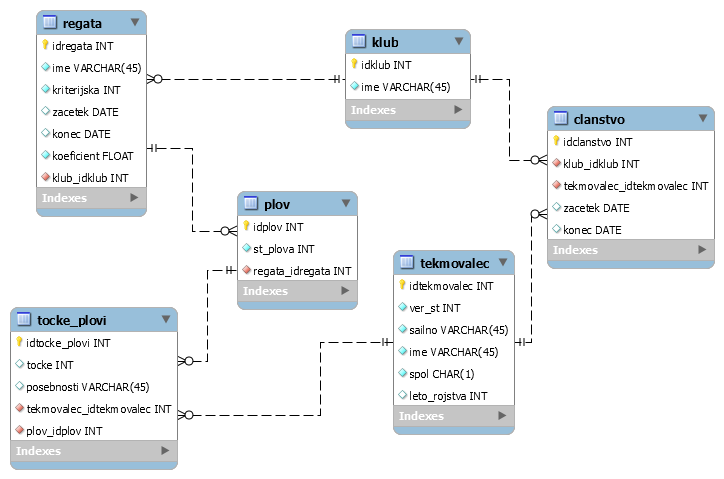

# Baza Regat
Avtorji:
- Jure Močnik Berljavac
- Matjaž Puh
- Zala Žnidaršič  
  
## Opis projekta  
  
Projekt pri predmetu Osnove podatkovnih baz na Fakulteti za matematiko in fiziko.  
  
Ideja je, da bi ustvarili podatkovno bazo regat (jadralskih tekmovanj) za mladinski razred Optimist v sklopu [Jadralne Zveze Slovenije](http://www.jzs.si/) (JZS). Glavni cilj je izdelava kriterijske lestvice tekmovalcev, na podlagi katere določijo jadralce, ki predstavljajo Slovenijo na svetovnem in evropskem prvenstvu razreda Optimist. Aplikacijo bi bilo možno posplošiti na vse jadralne razrede, poleg kriterijske lestvice pa bi bila uporabna za prikazovanje rezultatov posameznih regat in celo plovov, iz katerih so sestavljene. Rezultat projekta bi bila aplikacija, ki bi združevala vse informacije o rezultatih tekmovalcev, ki so sedaj razpršene po spletu in težje dostopne, tudi zaradi različnega formata. Velika prednost bi bila avtomatična izdelava kriterijske lestvice, ki jo trenutno zadolženi na JZS ročno dopolnjujejo.

